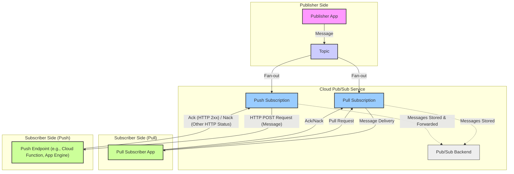
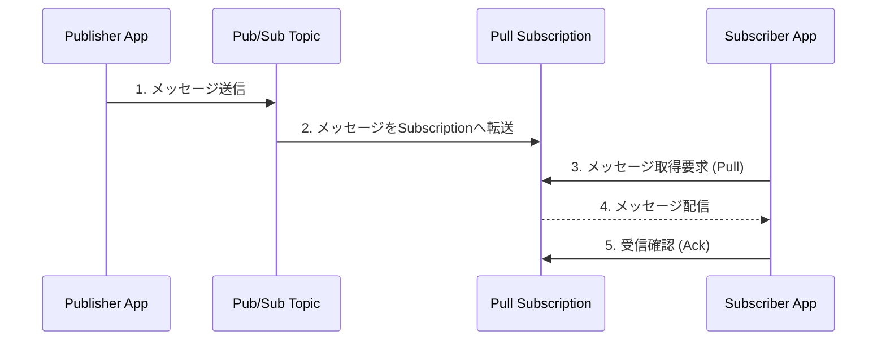
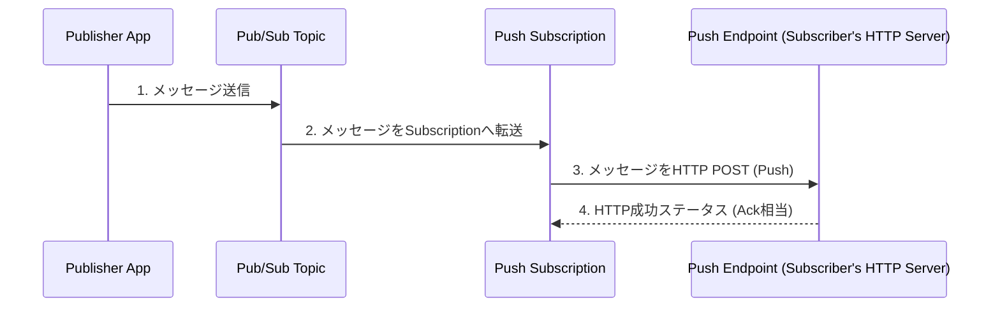

# Cloud Pub/Sub ローカル検証

このリポジトリは、Cloud Pub/Sub のエミュレーターを使って、Cloud Pub/Sub の Pull 型と Push 型の挙動を検証するためのものです。

Cloud Pub/Sub の詳細については、公式ドキュメントを参照してください。
https://cloud.google.com/pubsub/docs/overview?hl=ja

以下に Mermaid でざっくりとした構成を示します。



# 環境構築手順

## Python

### パッケージ管理

Python は uv を使って環境構築を行います。

uv のインストール（初回のみ）

```
brew install uv
```

仮想環境の構築

```
uv venv
```

仮想環境のアクティベート

```
source .venv/bin/activate
```

パッケージの追加削除

```
uv add xxx

uv remove xxx
```

pyproject.toml に記載のパッケージを追加

```
uv sync
```

### Linter/Formatter

Linter/Formatter は ruff を使います。

バージョン

```
> uv run ruff --version
ruff 0.11.12
```

違反を検出

```
uv run ruff check .
```

違反を検出し、修正まで行う

```
uv run ruff check . --fix
```

VScode の拡張機能も設定します。

拡張機能
https://marketplace.visualstudio.com/items?itemName=charliermarsh.ruff

.vscode/settings.json

```
    "[python]": {
        "editor.defaultFormatter": "charliermarsh.ruff",
        "editor.formatOnSave": true,
        "editor.codeActionsOnSave": {
            "source.fixAll.ruff": "explicit", // 保存時にRuffの修正をすべて適用
            "source.organizeImports.ruff": "explicit" // 保存時にRuffでimport文を整理 (明示的に設定する場合)
        }
    },
```

## Pub/Sub emulator

以下のドキュメントに記載されている環境がローカル上に構築されていることが前提となります。
https://cloud.google.com/pubsub/docs/emulator?hl=ja

emulator 起動

```

gcloud beta emulators pubsub start --project=my-local-project --host-port=localhost:8085

```

※ ソースコード上も localhost:8085 前提なので注意

## Pull 型

※ Pub/Sub の emulator が起動されている前提

1. トピックとサブスクリプションの作成

```
uv run python pull/publisher.py
uv run python pull/subscriber.py
```

2. サブスクライバーの起動

```
uv run python pull/subscriber.py
```

3. データをパブリッシュ

```
uv run python pull/publisher.py
```

4. 出力

```
> uv run python pull/publisher.py
トピック projects/my-local-project/topics/my-topic は既に存在します。
Publish しました (ID: 16): メッセージ 1
Publish しました (ID: 17): メッセージ 2
Publish しました (ID: 18): メッセージ 3
Publish しました (ID: 19): メッセージ 4
Publish しました (ID: 20): メッセージ 5

```

```
> uv run python pull/subscriber.py
サブスクリプション projects/my-local-project/subscriptions/my-subscription を projects/my-local-project/topics/my-topic に作成しました。
projects/my-local-project/subscriptions/my-subscription でメッセージを待機しています...
受信しました: メッセージ 1
受信しました: メッセージ 2
受信しました: メッセージ 3
受信しました: メッセージ 4
受信しました: メッセージ 5
```

### 【参考】 図解



## Push 型

※ Pub/Sub の emulator が起動されている前提

1. トピックとサブスクリプションの作成

```
uv run python push/publisher.py
uv run python push/subscriber_push.py
```

2. Push されたデータを受け取るエンドポイントサーバーの起動

```
uv run python push/push_endpoint_server.py
```

3. データをパブリッシュ

```
uv run python push/publisher.py
```

4. 出力

```
> uv run python push/publisher.py
トピック projects/my-local-project/topics/my-topic は既に存在します。
Publish しました (ID: 6): メッセージ 1
Publish しました (ID: 7): メッセージ 2
Publish しました (ID: 8): メッセージ 3
Publish しました (ID: 9): メッセージ 4
Publish しました (ID: 10): メッセージ 5
```

```
> uv run python push/push_endpoint_server.py
Pushエンドポイントサーバーを http://localhost:8081/push で起動します...
 * Serving Flask app 'push_endpoint_server'
 * Debug mode: off
WARNING: This is a development server. Do not use it in a production deployment. Use a production WSGI server instead.
 * Running on http://127.0.0.1:8081
Press CTRL+C to quit

--- メッセージ受信 ---
Raw envelope: {
  "subscription": "projects/my-local-project/subscriptions/my-push-subscription",
  "message": {
    "publishTime": "2025-05-25T11:44:52.635Z",
    "data": "44Oh44OD44K744O844K4IDE=",
    "publish_time": "2025-05-25T11:44:52.635Z",
    "messageId": "6",
    "attributes": {},
    "message_id": "6"
  }
}
  ID: 6
  公開日時: 2025-05-25T11:44:52.635Z
  データ: メッセージ 1
127.0.0.1 - - [25/May/2025 20:44:52] "POST /push HTTP/1.1" 204 -

--- メッセージ受信 ---

--- メッセージ受信 ---
Raw envelope: {
  "subscription": "projects/my-local-project/subscriptions/my-push-subscription",
  "message": {
    "publishTime": "2025-05-25T11:44:52.650Z",
    "data": "44Oh44OD44K744O844K4IDI=",
    "publish_time": "2025-05-25T11:44:52.650Z",
    "messageId": "7",
    "attributes": {},
    "message_id": "7"
  }
}
Raw envelope: {
  "subscription": "projects/my-local-project/subscriptions/my-push-subscription",
  "message": {
    "publishTime": "2025-05-25T11:44:52.665Z",
    "data": "44Oh44OD44K744O844K4IDM=",
    "publish_time": "2025-05-25T11:44:52.665Z",
    "messageId": "8",
    "attributes": {},
    "message_id": "8"
  }
}
  ID: 7
  ID: 8
  公開日時: 2025-05-25T11:44:52.650Z
  公開日時: 2025-05-25T11:44:52.665Z
  データ: メッセージ 3
127.0.0.1 - - [25/May/2025 20:44:52] "POST /push HTTP/1.1" 204 -
  データ: メッセージ 2
127.0.0.1 - - [25/May/2025 20:44:52] "POST /push HTTP/1.1" 204 -

--- メッセージ受信 ---
Raw envelope: {
  "subscription": "projects/my-local-project/subscriptions/my-push-subscription",
  "message": {
    "publishTime": "2025-05-25T11:44:52.679Z",
    "data": "44Oh44OD44K744O844K4IDQ=",
    "publish_time": "2025-05-25T11:44:52.679Z",
    "messageId": "9",
    "attributes": {},
    "message_id": "9"
  }
}
  ID: 9
  公開日時: 2025-05-25T11:44:52.679Z
  データ: メッセージ 4
127.0.0.1 - - [25/May/2025 20:44:52] "POST /push HTTP/1.1" 204 -

--- メッセージ受信 ---
Raw envelope: {
  "subscription": "projects/my-local-project/subscriptions/my-push-subscription",
  "message": {
    "publishTime": "2025-05-25T11:44:52.691Z",
    "data": "44Oh44OD44K744O844K4IDU=",
    "publish_time": "2025-05-25T11:44:52.691Z",
    "messageId": "10",
    "attributes": {},
    "message_id": "10"
  }
}
  ID: 10
  公開日時: 2025-05-25T11:44:52.691Z
  データ: メッセージ 5
127.0.0.1 - - [25/May/2025 20:44:52] "POST /push HTTP/1.1" 204 -

```

### 【参考】 図解


